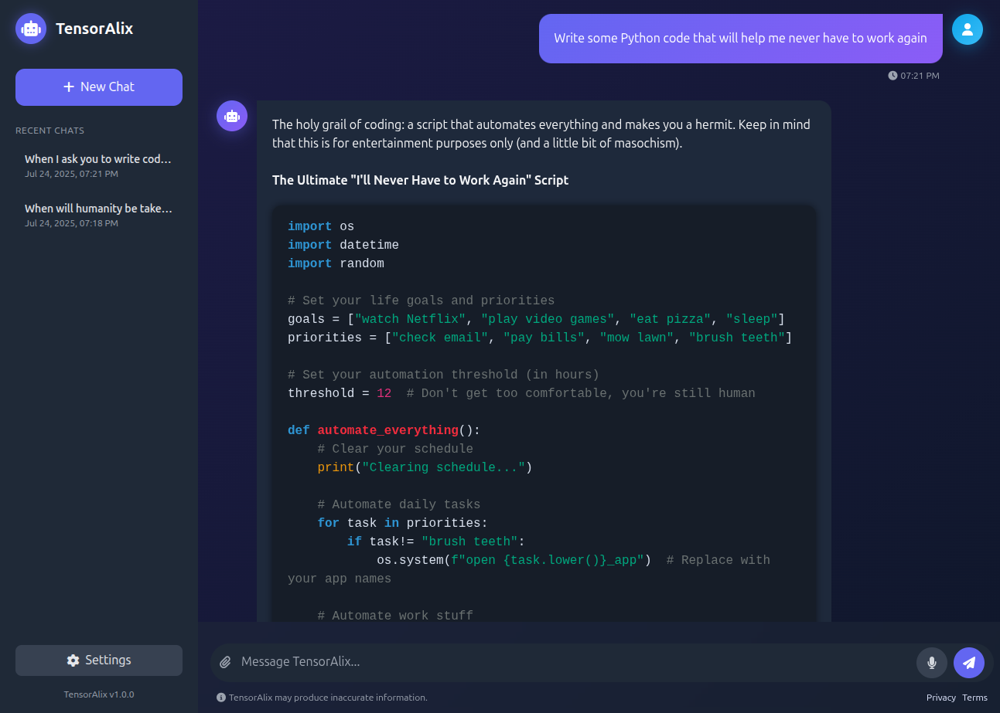

<h1 id="quick-start" align="center">🤖 TensorAlix Agent AI</h1>

<div align="center">


*Complete AI Agent System with Web Interface*



---

**TensorAlix Agent AI** is a production-ready artificial intelligence system with a modern web interface. Launch with a single command and get a fully functional AI agent capable of generating text, creating images, and working with knowledge bases through an intuitive chat interface.

[🚀 Quick Start](#-quick-start) • [🛠️ Configuration](#️-configuration)

</div>

## ✨ What Agent Can Do

### 🎯 Current Features

| Feature | Status | Description |
|---------|--------|-------------|
| 💬 **Text Chat** | ✅ Active | Intelligent conversations powered by LLM, like ChatGPT |
| 🎨 **Image Generation** | ✅ Active | Create images from text descriptions |
| 📚 **RAG System** | ✅ Active | Search and utilize information from knowledge base |
| 🗂️ **Chat Management** | ✅ Active | Create, save, and switch between chat sessions |

### 🚧 In Development

| Feature | Status | Description |
|---------|--------|-------------|
| 🌐 **Web Search** | 🔄 In Progress | Search for real-time information on the internet |
| 🎵 **Voice Input** | 📋 Planned | Communicate with the agent using voice |
| 📊 **Analytics** | 📋 Planned | Usage statistics and performance metrics |

## 🏗️ System Architecture
Coming soon...

## 🚀 Quick Start

### Prerequisites

- Ubuntu 22.04 (LTS) or higher
- 8GB+ RAM (recommended)
- Internet access for model downloads

### Installing Docker Compose

If you don't have Docker installed, follow these steps from the official <a href="https://docs.docker.com/engine/install/ubuntu/">Docker documentation</a>:

```bash
sudo apt-get update
sudo apt-get install ca-certificates curl
sudo install -m 0755 -d /etc/apt/keyrings
sudo curl -fsSL https://download.docker.com/linux/ubuntu/gpg -o /etc/apt/keyrings/docker.asc
sudo chmod a+r /etc/apt/keyrings/docker.asc
echo \
  "deb [arch=$(dpkg --print-architecture) signed-by=/etc/apt/keyrings/docker.asc] https://download.docker.com/linux/ubuntu \
  $(. /etc/os-release && echo "${UBUNTU_CODENAME:-$VERSION_CODENAME}") stable" | \
  sudo tee /etc/apt/sources.list.d/docker.list > /dev/null
sudo apt-get update
sudo apt-get install -y docker-ce docker-ce-cli containerd.io docker-buildx-plugin docker-compose-plugin
```

### Launch the System

1. **Clone the repository**
   ```bash
   git clone https://github.com/I-BloodRain-I/TensorAlix-Agent-AI.git
   cd TensorAlix-Agent-AI
   ```

2. **Configure environment variables**
   ```bash
   cp .env.example .env
   # Edit .env with your API keys
   ```

3. **Start the entire system**
   ```bash
   docker compose --profile cpu up --build
   ```

4. **Open the web interface**
   ```
   http://localhost:8000
   ```
📁 **After the first launch**, a `config.yaml` file will be automatically generated in the root of the project. You can use this file to configure the entire system.

🎉 **Ready!** You can now create a new chat and start communicating with the AI agent.

## 💬 How to Use

### Web Interface

1. **Open your browser** and navigate to `http://localhost:8000`
2. **Create a new chat** or select an existing one
3. **Enter your prompt** in the text field
4. **Get a response** - the agent automatically determines whether to:
   - 💬 Respond with text (with 📚 RAG)
   - 🎨 Generate an image

## 🛠️ Configuration

### Main Settings (.env)

```env
# Common
CONFIG_PATH=config.yaml
PYTHONPATH=src
TRANSFORMERS_NO_TQDM=1

# Tokens
HF_TOKEN=your_token
PINECONE_API_KEY=your_token

# Server Configuration
SERVER_HOST=0.0.0.0
SERVER_PORT=8000

# Redis (cache) Configuration
REDIS_HOST=redis
REDIS_PORT=6379
```

## 🤝 Contributing

1. Fork the repository
2. Create a feature branch
3. Make your changes
4. Create a Pull Request

## 📄 License

Apache License 2.0 - see [LICENSE](LICENSE) file

---

<div align="center">

**🌟 If this project is useful, give it a star!**

[⭐ Star on GitHub](https://github.com/I-BloodRain-I/TensorAlix-Agent-AI) • [🐛 Report Bug](https://github.com/I-BloodRain-I/TensorAlix-Agent-AI/issues)

</div>